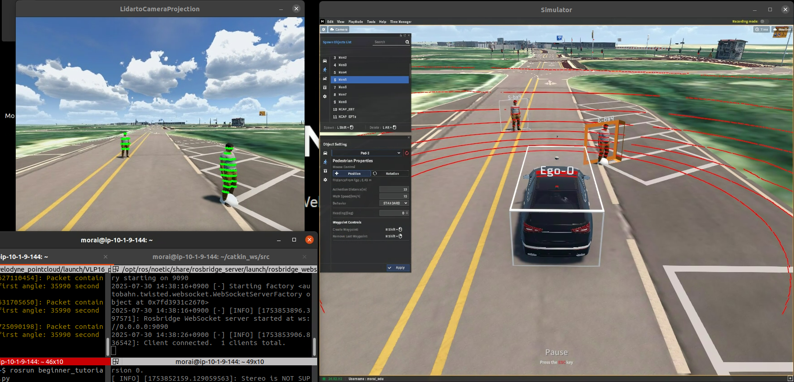
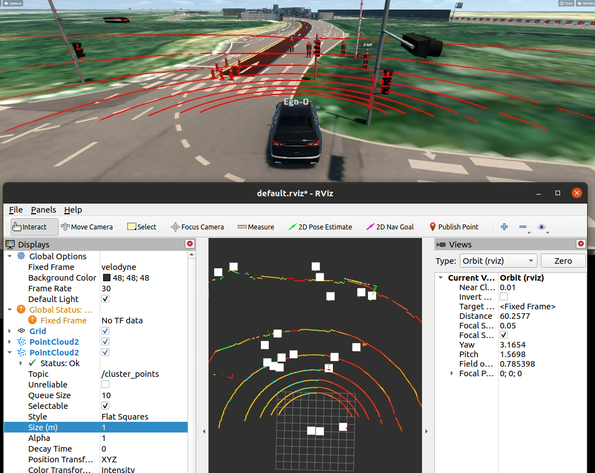

# 3주차 - 자율주행 경로계획 및 제어시스템

## 개요

이 주차에서는 자율주행 차량의 핵심 기술인 **경로계획(Path Planning)**과 **제어(Control)** 시스템을 구현합니다. Pure Pursuit 알고리즘을 기반으로 한 경로 추종과 Lattice Planner를 이용한 장애물 회피 시스템을 통해 완전한 자율주행 시스템을 구축합니다.

## 핵심 개념

### 1. Pure Pursuit 알고리즘

Pure Pursuit은 자율주행 차량에서 가장 널리 사용되는 경로 추종 알고리즘 중 하나입니다.

#### 동작 원리
- 차량의 현재 위치에서 일정 거리(Look Ahead Distance) 앞의 경로점을 찾음
- 해당 점을 향해 조향각을 계산하여 차량을 제어
- 속도에 비례하여 Look Ahead Distance를 동적으로 조정

#### 수학적 모델
```
조향각 = atan2(2 * L * sin(α), L)
```
- L: 차량의 휠베이스 길이
- α: 현재 위치에서 목표점까지의 각도

### 2. Lattice Planner

Lattice Planner는 격자 기반 경로 계획 알고리즘으로, 장애물 회피에 특화되어 있습니다.

#### 특징
- 다중 경로 생성으로 다양한 회피 옵션 제공
- 비용 함수를 통한 최적 경로 선택
- 실시간 장애물 감지 및 회피 경로 생성

## 시스템 아키텍처

```
┌─────────────────┐    ┌─────────────────┐    ┌─────────────────┐
│   GPS/IMU      │───▶│ gpsimu_parser   │───▶│     /odom       │
│   Sensors      │    │                 │    │                 │
└─────────────────┘    └─────────────────┘    └─────────────────┘
                                │
                                ▼
┌─────────────────┐    ┌─────────────────┐    ┌─────────────────┐
│   kcity.txt    │───▶│global_path_pub  │───▶│  /global_path   │
│   Path Data    │    │                 │    │                 │
└─────────────────┘    └─────────────────┘    └─────────────────┘
                                │
                                ▼
┌─────────────────┐    ┌─────────────────┐    ┌─────────────────┐
│   /odom        │───▶│local_path_pub   │───▶│  /local_path    │
│   Position     │    │                 │    │                 │
└─────────────────┘    └─────────────────┘    └─────────────────┘
                                │
                                ▼
┌─────────────────┐    ┌─────────────────┐    ┌─────────────────┐
│   /local_path  │───▶│ lattice_planner │───▶│ /lattice_path   │
│   + Objects    │    │                 │    │                 │
└─────────────────┘    └─────────────────┘    └─────────────────┘
                                │
                                ▼
┌─────────────────┐    ┌─────────────────┐    ┌─────────────────┐
│ /lattice_path  │───▶│pure_pursuit_pid │───▶│   /ctrl_cmd     │
│ + /odom        │    │velocity_planning│    │                 │
└─────────────────┘    └─────────────────┘    └─────────────────┘
```

## 구현 상세

### 1. 전역 경로 발행 (global_path_pub.py)

```python
# 주요 기능
- kcity.txt 파일에서 경로 데이터 읽기
- /global_path 토픽으로 전역 경로 발행
- 20Hz 주기로 지속적인 경로 데이터 제공
```


### 2. 센서 데이터 처리 (gpsimu_parser.py)

```python
# 주요 기능
- GPS 위도/경도 → UTM 좌표계 변환
- IMU 방향 데이터 처리
- /odom 토픽으로 통합 위치 정보 발행
```



### 3. 지역 경로 생성 (local_path_pub.py)

```python
# 주요 기능
- 현재 위치에서 가장 가까운 웨이포인트 찾기
- 50개 웨이포인트로 구성된 지역 경로 생성
- /local_path 토픽으로 지역 경로 발행
```

### 4. 장애물 회피 경로 계획 (lattice_planner.py)

Lattice Planner는 장애물이 감지되었을 때 다중 경로를 생성하여 최적의 회피 경로를 선택합니다.

#### 장애물 감지 알고리즘
```python
def checkObject(self, ref_path, object_data):
    is_crash = False
    for obstacle in object_data.obstacle_list:
        for path in ref_path.poses:  
            dis = sqrt(pow(path.pose.position.x - obstacle.position.x, 2) + 
                      pow(path.pose.position.y - obstacle.position.y, 2))                
            if dis < 2.35:  # 충돌 판정 거리
                is_crash = True
                break
    return is_crash
```

#### 경로 선택 알고리즘
```python
def collision_check(self, object_data, out_path):
    selected_lane = -1        
    lane_weight = [3, 2, 1, 1, 2, 3]  # 기준 경로 가중치
    
    for obstacle in object_data.obstacle_list:                        
        for path_num in range(len(out_path)) :                    
            for path_pos in out_path[path_num].poses :                                
                dis = sqrt(pow(obstacle.position.x - path_pos.pose.position.x, 2) + 
                          pow(obstacle.position.y - path_pos.pose.position.y, 2))
                if dis < 1.5:  # 안전 거리
                    lane_weight[path_num] = lane_weight[path_num] + 100

    selected_lane = lane_weight.index(min(lane_weight))     
    return selected_lane
```


### 5. 차량 제어 (pure_pursuit_pid_velocity_planning.py)

#### Pure Pursuit 조향 제어
```python
def calc_pure_pursuit(self):
    # Look Ahead Distance 계산 (속도에 비례)
    self.lfd = self.lfd_gain * self.status_msg.velocity.x
    if self.lfd < self.min_lfd:
        self.lfd = self.min_lfd
    elif self.lfd > self.max_lfd:
        self.lfd = self.max_lfd
    
    # 전방 주시점 찾기
    for i in range(len(self.path.poses)):
        path_point = self.path.poses[i].pose.position
        dis = sqrt(pow(path_point.x - self.current_postion.x, 2) + 
                  pow(path_point.y - self.current_postion.y, 2))
        if dis >= self.lfd:
            self.forward_point = path_point
            self.is_look_forward_point = True
            break
    
    # 조향각 계산
    alpha = atan2(self.forward_point.y - self.current_postion.y, 
                  self.forward_point.x - self.current_postion.x) - self.vehicle_yaw
    steering = atan2(2.0 * self.vehicle_length * sin(alpha), self.lfd)
    
    return steering
```

#### PID 속도 제어
```python
class pidControl:
    def __init__(self):
        self.p_gain = 0.3
        self.i_gain = 0.00
        self.d_gain = 0.03
        self.prev_error = 0
        self.i_control = 0
        self.controlTime = 0.033

    def pid(self, target_vel, current_vel):
        error = target_vel - current_vel
        
        # P 제어
        p_control = self.p_gain * error
        
        # I 제어
        self.i_control += error * self.controlTime
        i_control = self.i_gain * self.i_control
        
        # D 제어
        d_control = self.d_gain * (error - self.prev_error) / self.controlTime
        
        output = p_control + i_control + d_control
        self.prev_error = error
        
        return output
```

#### 곡률 기반 속도 계획
```python
class velocityPlanning:
    def __init__(self, car_max_speed, road_friction):
        self.car_max_speed = car_max_speed
        self.road_friction = road_friction

    def curvedBaseVelocity(self, global_path, point_num):
        out_vel_plan = []
        
        for i in range(0, point_num):
            out_vel_plan.append(self.car_max_speed)

        for i in range(point_num, len(global_path.poses) - point_num):
            x_list = []
            y_list = []
            for box in range(-point_num, point_num):
                x = global_path.poses[i + box].pose.position.x
                y = global_path.poses[i + box].pose.position.y
                x_list.append([-2 * x, -2 * y, 1])
                y_list.append(-(x * x) - (y * y))

            x_matrix = np.array(x_list)
            y_matrix = np.array(y_list)
            x_trans = x_matrix.T

            a_matrix = np.linalg.inv(x_trans.dot(x_matrix)).dot(x_trans).dot(y_matrix)
            a = a_matrix[0]
            b = a_matrix[1]
            c = a_matrix[2]

            r = sqrt(a * a + b * b - c)
            v_max = sqrt(r * 9.8 * self.road_friction)
            
            if v_max > self.car_max_speed:
                v_max = self.car_max_speed
            out_vel_plan.append(v_max)

        for i in range(len(global_path.poses) - point_num, len(global_path.poses)):
            out_vel_plan.append(self.car_max_speed)

        return out_vel_plan
```

## 시뮬레이션 결과

### 클러스터링된 포인트 클라우드


### 라이다 센서 데이터


## 핵심 토픽 및 메시지

| 토픽명 | 메시지 타입 | 설명 |
|--------|-------------|------|
| `/global_path` | `nav_msgs/Path` | 전역 경로 데이터 |
| `/odom` | `nav_msgs/Odometry` | 차량 위치 및 방향 정보 |
| `/local_path` | `nav_msgs/Path` | 지역 경로 데이터 |
| `/lattice_path` | `nav_msgs/Path` | 장애물 회피 경로 |
| `/ctrl_cmd` | `morai_msgs/CtrlCmd` | 차량 제어 명령 |

## 실행 방법

1. **전역 경로 발행**
   ```bash
   rosrun beginner_tutorials global_path_pub.py
   ```

2. **센서 데이터 처리**
   ```bash
   rosrun beginner_tutorials gpsimu_parser.py
   ```

3. **지역 경로 생성**
   ```bash
   rosrun beginner_tutorials local_path_pub.py
   ```

4. **장애물 회피 경로 계획**
   ```bash
   rosrun beginner_tutorials lattice_planner.py
   ```

5. **차량 제어**
   ```bash
   rosrun beginner_tutorials pure_pursuit_pid_velocity_planning.py
   ```

## 성능 최적화 팁

1. **Look Ahead Distance 조정**: 차량의 특성에 맞게 `lfd_gain` 값을 조정
2. **PID 게인 튜닝**: 차량의 동적 특성에 맞게 P, I, D 게인 조정
3. **안전 거리 설정**: 장애물 감지 및 회피 거리를 환경에 맞게 조정
4. **경로 해상도**: 계산 효율성과 정확도의 균형을 고려한 경로점 간격 설정

## 결론

이 주차에서는 자율주행의 핵심 기술인 경로계획과 제어 시스템을 구현했습니다. Pure Pursuit 알고리즘을 통한 정확한 경로 추종과 Lattice Planner를 통한 안전한 장애물 회피를 통해 완전한 자율주행 시스템을 구축할 수 있었습니다. 

다음 주차에서는 더 고급 경로계획 알고리즘이나 센서 융합 기술을 다룰 예정입니다. 